# RPC documentation

## Installation
# note:
- You need to compile the full OpenSSL and Protobuf 
Download OpenSSL-3.0.5
 ```shell
    tar -xvf openssl-3.0.5.tar.gz
    cd openssl-3.0.5
    ./Configure 
    make && make install
 ```
  Download Protobuf-CPP-3.21.9
 ```shell
    unzip protobuf-cpp-3.21.9
    cd protobuf-cpp-3.21.9
    cd cmake && mkdir build
    cd build
    cmake .. && make && make install
 ```

```shell
    cd rpc_lib
    cd build
    cmake ..
```


# What is this
 This is the TFSC RPC trading interface.
 Send transaction requests through the HTTP protocol (including transactions, pledges, unstake, investments, uninvestment, deployment contracts, execution contracts).
 All interfaces are transmitted in the Fangshan of post json

# How to use
  1. Fill in the request JSON in the fixed format of each rpc_api, and call rpc_api to get the transaction body
  2. Use RPC SDK to sign the transaction body and call the send_message interface to broadcast the transaction


# Below are the details of all interfaces

## Get Balance get_balance
Request JSON
```json
    {
        "type": "get_balance",
        "addr":"1123d98U15uwSWnSMJNMHChRJUsyjbLq5H"//base58
    }
```
Returns JSON
```json
{
        "ErrorCode": "",
        "ErrorMessage": "",
        "addr": "",
        "balance": "",//balance
        "type": ""
}
```

#### Usage
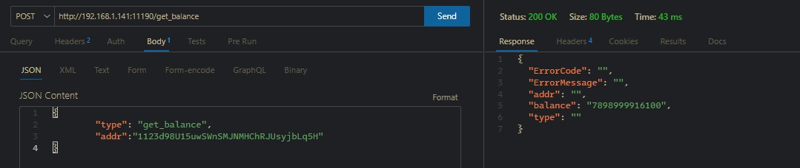

## Trading get_transaction_req
   Request JSON
```json
 {
    "type": "get_transaction_req",
    "fromAddr": [
            ""// Transfer source address
          ],
    "toAddr":[{
            "addr": "", // Transfer destination address
            "value": ""//Transfer amount
    }]
}
```
Returns <font color=#37a4dc size=5>**transaction body json**</font>, which is the structure returned by all transactions (get_transaction_req, get_stake_req, get_unstake_req, get_invest_req, get_disinvest_req, deploy_contract_req
, call_contract_req, will return this json) needs to be signed sig_Tx interface and then sent through the send_message interface
```json
{
  "ErrorCode": "0",
  "ErrorMessage": "",
  "gas": "",
  "height": "",
  "time": "",
  "txJson": "",
  "txType": "0",
  "type": "",
  "vrfJson": "{}"
}
```
#### Usage
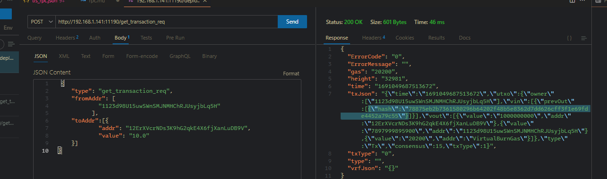
<br/> The return value of this RPC interface needs to be signed with the SDK sig_Tx interface and then sent over the send_message interface

## Staking transactions get_stake_req
Request JSON
```json
{
        "type": "get_stake_req",
        "fromAddr": "", // Stake source address
        "stake_amount": "", // Stake destination address
        "PledgeType": "0"
  
}
```
Returns <font color=#37a4dc size=5>**transaction body json**</font>

#### Usage
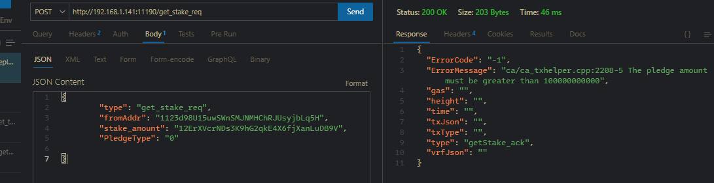
<br/> The return value of this RPC interface needs to be signed with the SDK sig_Tx interface and then sent over the send_message interface


## Unstaking transactions get_unstake_req

Request JSON
```json
    {
        "type": "get_unstake_req",
        "fromAddr": "", // unpledged address
        "utxo_hash": ""// UTXO for staking transactions, obtained by get_stakeutxo_req
    }      
```
Returns <font color=#37a4dc size=5>**transaction body json**</font>

#### Usage
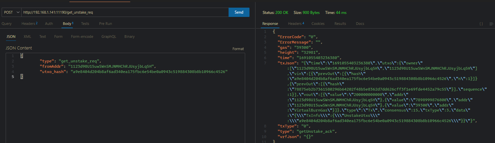
<br/> The return value of this RPC interface needs to be signed with the SDK sig_Tx interface and then sent over the send_message interface


## Get the staked UTXO get_stakeutxo_req
Request JSON
```json 
{
        "type": "get_stakeutxo_req",
        "fromAddr": ""// utxo of the unpledged address
}
```
Returns JSON
```json
{
  "ErrorCode": "0",
  "ErrorMessage": "",
  "type": "",
  "utxos": [
    {
      "utxo": "", // return the staked utxo
      "value": 0// staked amount
    }
  ]
}
```
#### Usage
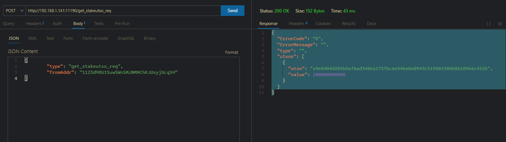
<br/> This RPC interface is a parameter to get the utxo_hash segment of the get_unstake_req


## Investment Trading get_invest_req
```json
Request JSON
{
        "type": "get_invest_req",
        "fromAddr": "", // Investment source address
        "toAddr": "", // Investment target address
        "invest_amount": "",
        "investType": "0"
}
```
Returns <font color=#37a4dc size=5>**transaction body json**</font>
#### Usage
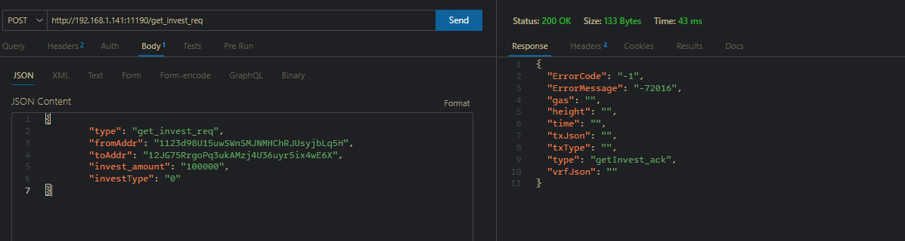
<br/> The return value of this RPC interface needs to be signed with the SDK sig_Tx interface and then sent over the send_message interface


## Solve the Investment Trading get_disinvest_req
Request JSON
```json

{
        "type": "get_disinvest_req",
        "fromAddr": "", // Investment source address
        "toAddr": "", // Investment target address
        "utxo_hash": ""// Invested UTXO
    }
```
Returns <font color=#37a4dc size=5>**transaction body json**</font>
### How to use it 
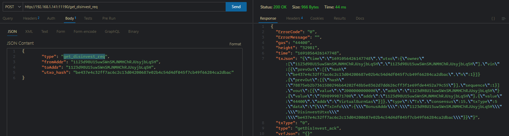
<br/> The return value of this RPC interface needs to be signed with the SDK sig_Tx interface and then sent over the send_message interface


## Claim Transaction get_bonus_req
Request JSON
```json
{
        "type": "get_bonus_req",
        "Addr": ""// Application address
}

```
Returns <font color=#37a4dc size=5>**transaction body json**</font>
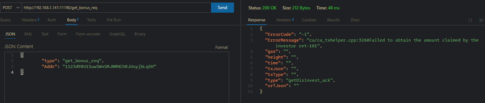
<br/> The return value of this RPC interface needs to be signed with the SDK sig_Tx interface and then sent over the send_message interface


## send_message interface
<br /> This interface is to send the transaction body back to the node for broadcast after the transaction body is signed (sig_Tx).
Send JSON
```json
{
    "type":"tx_ack",
    "txJson":"",
    "height":"",
    "vrfJson":"",
    "txType":"",
    "time":"",
    "gas":""
}
```
Returns JSON
```json
{ 
    "type":"",
    "ErrorCode":"",
    "ErrorMessage":"",
    "txhash":""//transaction hash
}
```
## Get the transaction on-chain rate
```json 
Request JSON
{
        "type": "get_isonchain",
        "txhash": ""//transaction hash
}
```
Returns JSON
```json
 {
  "ErrorCode": "0",
  "ErrorMessage": "",
  "pro": "",//on-chain rate
  "txhash": "",
  "type": ""
}
```
### How to use it
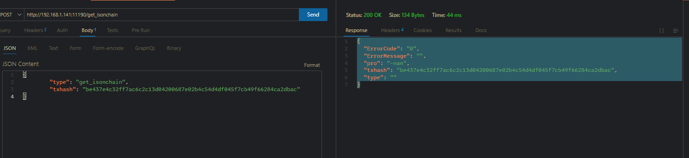


### Deploy smart contract deploy_contract_req
Request JSON
```json
{
   "type":"contract_info",
    "name":"",// contract name
    "language":"",// contract language
    "languageVersion":"",// contract version
    "standard":"",// contract standard
    "logo":"",// contract logo
    "source":"",// contract source code
    "ABI":"",//abi
    "userDoc":"",//Use documentation
    "developerDoc":"",// Development documentation
    "compilerVersion":"",// contract compiler version
    "compilerOptions":"",// contract compilation parameters
    "srcMap":"",//
    "srcMapRuntime":"",
    "metadata":"",
    "other":""
},

{
    "type":"deploy_contract_req",
    "addr":"",//deployment address
    "nContractType":"",// The type of the contract
    "info":"",//contract information(contract_info)
    "contract":"",// contract
    "data":"",//code
    "pubstr":""//base64 of the public key of the deployment address

}
```
Returns <font color=#37a4dc size=5>**transaction body json**</font>
<br/> The return value of this RPC interface needs to be signed with the SDK sig_Tx interface and then sent over the send_message interface


## Execute the contract call_contract_req
```json
{
    "type":"call_contract_req",
    "addr":"",//execute address
    "deployer":"",//execute address
    "deployutxo":"",//deployed utxo
    "args":"",// parameter
    "pubstr":"",// Execute address of the public key base64
    "tip":"",// tip
    "money":""// Transfer money to the contract
}
```
Returns <font color=#37a4dc size=5>**transaction body json**</font>
### How to use it
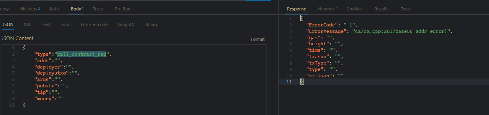
<br/> The return value of this RPC interface needs to be signed with the SDK sig_Tx interface and then sent over the send_message interface


## Get the UTXO deploy_utxo_req for the deployment contract
Request JSON
```json
{   
    "type":"deploy_utxo_req",
    "addr":"",//deployment address
}
```
Returns JSON
```json
{
  "ErrorCode": "",
  "ErrorMessage": "",
  "type": "",
  "utxos": []//deployed utxo
}
```
#### Usage
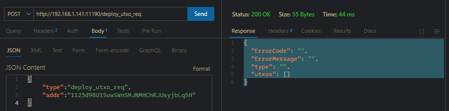
<br/> This interface is fetched call_contract_req


# SDK interface description

```c
/*Get the private key handle from private key base64*/
/**
 * @brief 
 * 
 * @param the buf private key base64 string
 * @param buf_size length
 * @return long long 
 */
long long import_base64_prikey_handler(const char *buf, int buf_size);
/*Get a new base64 private key*/
char *export_new_prikey_base64();
/*Get the private key handle from private key base 16*/
/**
 * @brief 
 * 
 * @param str private key hexadecimal string
 * @return long long 
 */
long long import_prikey_handler_from_hex(const char *str);
/*Get a new base 16 private key*/
/**
 * @brief 
 * 
 * @param pkey private key handle
 * @return char* 
 */
char *export_new_prikey_to_hex(long long pkey);
/*Export mnemonic phrase from private key handle*/
/**
 * @brief 
 * 
 * @param pkey private key handle
 * @return char* 
 */
char *export_mnemonic_from_prikey_handler(long long pkey);
/*Get private key handle from mnemonic phrase*/
/**
 * @brief 
 * 
 * @param mnemonic mnemonic
 * @return long long 
 */
long long import_prikey_handler_from_mnemonic(const char *mnemonic);

/*Get base58 from private key handle*/
char *get_base58addr(long long pkey);
/*Get the public key base64 from the private key handle*/
char *get_pubstr_base64(long long pkey);
/*Sign transactions using a private key handle*/
char *sig_tx(long long pkey, const char *message, int msize);
/*Release the private key handle*/
void free_prikey_handler(long long pkey);
/*Get base58 from EVM address*/
char * get_base58_from_evm(const char * evmAddr);
/*Get EVM address from public key*/
/**
 * @brief Get the evmaddr from pubstr object
 * 
 * @param pubstr public key binary
 * @param pubstr_size Binary length
 * @return char* 
 */
char *get_evmaddr_from_pubstr(const char * pubstr,int pubstr_size);
```
# examples
- see test dir